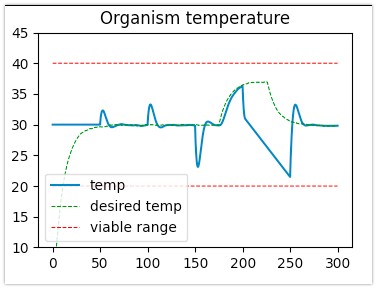
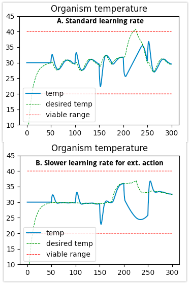
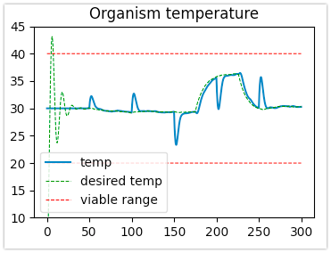

# Hierarchical thermostatic agent based on free energy principle

## Authors
Mikhail Yaroshevskiy

## High-level description
This project tends to implement (roughly) the hierarchical model of active inference, presented by Pezzulo et at. in ["Active Inference, homeostatic regulation and adaptive behavioural control"](http://dx.doi.org/10.1016/j.pneurobio.2015.09.001). We start with an agent having simple interoceptive active inference behaviour (autonomic reflex) which is then extended to have exteroceptive sensors and exteroceptive action. We then show why proprioception is also important to produce effective and adaptive behaviour. Proposed agent can be further extended with more layers of hierarchy (unconditional and Pavlovian reflexes, goal-directed behaviour) to allow an agent to use more information about the world and be more adaptive. This project looks at the FEP from adaptive systems point of view, parting from Ashby's ideas of homeostatic regulation rather then (passive) Helmholtzian perspective of perception as inference (following the point of view of Anil Seth in ["The Cybernetic Bayesian Brain"](https://www.doi.org/10.15502/9783958570108)).

## Current progress
### Purely interoceptive agent
The simplest interoceptive agent resembles a thermostat. This agent uses FEP based on maths behind simple dynamical generative model presented in ["The free energy principle for action and perception: A mathematical
review"](http://dx.doi.org/10.1016/j.jmp.2017.09.004) by Buckley et al. in chapter 7.

An agent lives in a world where the only thing it needs to care about is maintaining its temperature inside a viable interval. It can sense the current temperature and change of this temperature. It acts setting the  desired change of temperature directly. Though, as agent is bounded by physics of its body, it can only set this change inside a boundary (±5.8 °C per time step). It's viable range is 30 ±10 °C.

Initial temperature of an agent is set to the mean of the viable range (30 °C). An agent is given a small time (50 time steps) to infer the current temperature (as it's assumed to be unknown at the beginning of the simulation). After this, the world is simulated such way an agent experiences a change of temperature at each timestep in a following way:
* time steps from 50 to 100: +2 °C per time step
* time steps from 101 to 150: +5 °C per time step
* time steps from 151 to 200: -1 °C per time step
* time steps from 201 to 250: -6 °C per time step
* time steps from 251 to 300: 0 °C per time step (agent is not experiencing a change in temperature)

Simulation ends at the time step 300.

From the provided simulation (Figure 1) it can be observed that an agent can effectively deal with changes of temperature (both constant and sudden) and maintain itself in a viable interval for most of the environmental disturbances. The twist comes from the fact that at time steps from 201 to 250 an agent experiences a change of -6 °C per step, while it can only regulate the temperature by +5.8 °C per step. This means, the temperature of an agent will be dropping (-0.2 °C per step) despite its affords, and eventually will go out of the viable boundaries (be less than 20 °C). Effectively and sadly, our agent would cease to exist.


*Figure 1. Simple interoceptive-only agent. An agent is shown to be able to regulate its temperature in principle. Despite this, it fails to do so when the temperature is dropping faster (steps 200 to 250) than its physiological ability to heat itself. In the simulated environment our an agent would cease to exist.*

### Adding exteroception
As mentioned above, this project is inspired in (and roughly follows the) hierarchical model of active inference, presented by Pezzulo et at. in "Active Inference, homeostatic regulation and adaptive behavioural control". While an agent would die in the simulated world acting purely on its interoceptive inference, the hope should come from implementing (a next hierarchical level of) exteroception. It is hypothesised that this should allow an agent to have an unconditioned reflex: when provided with an exteroceptive cue (e.g. change in light), an agent should make it's temperature higher *in advance* in order to survive the following drop (or rise) of the temperature. Such next level should provide the underlying interoceptive layer with a different generative model (new settling point), altering this way the underlying interoceptive behaviour. In other words, an agent feelings of cold and hot are not absolute, but dictated by the higher (exteroceptive) level of the hierarchy, allowing it to be more adaptive.

To implement this proposal, we extend an agent with the exteroceptive layer, giving it an ability to perform an unconditioned (autonomic) reflex based on both *exteroceptive* and *interoceptive* inference. An agent is now given a sense of luminosity change per step. It is assumed that in the world where an agent is situated, a drop of temperature is preceded by a luminosity drop (and vise versa). A generative model of perception is given to an agent, with which it can infer which *desired temperature* generates the change in luminosity. This inferred desired temperature is then passed to the lower, interoceptive level, to set the desired dynamics of an agent. The provided simulation shows, how an agent can now effectively survive the drop of temperature by making its own temperature higher *in advance* once the luminosity starts to drop. Effectively, an agent now will survive in this world -- the task that was impossible with interoceptive inference only.



*Figure 2. An agent with exteroception. The world where an agent lives is assumed to experience a drop in light before temperature starts to drop and vise versa. An agent is extended to infer the desired temperature through the change in light. When light start to drop from the timestep 175, the desired temperature of the agent grows. This allows the agent to survive the following drop in temperature from the time steps 200 to 250.*

### Adding active exteroception
Pezzulo et at. have proposed, that "at the higher levels of the hierarchy ... representations become *amodal or multimodal* – providing descending predictions in the exteroceptive, autonomic and proprioceptive domains". This extension aims to roughly implement this idea and show it's viability. 

While our agent already has interoceptive and exteroceptive sensors, it can only act interoceptively (by setting the desired temperature based on exteroception and setting it's temperature change based on interoception). We can easily imagine a world, where adding exteroceptive action could be beneficial for our agent and which would make it more adaptive (an evolution would definitely do so eventually). We can now assume an agent lives in water environment. In this environment it observes more sunlight in warmer places (closer to the light) and less sunlight in colder places (further from the light). Now an agent equipped with this simple relationship thought a generative model show be able to act in the world and find better temperature regimes acting exteroceptively. In other words, it would seek to find such exteroceptive dynamics (change in light) that would better explain its brain variable (temperature change) through acting (setting the change in light). Here two things are worth a more detailed explanation. First, the right generative model would be such, that encodes the inverse relationship between the internal temperature change and change in light. This way our agent would seek darker places (less light) when its body gets hotter and vise versa. Second, and more importantly, it seems there is a big assumption when we say that the agent can change the light directly. Indeed, an agent is actually moving up and down in the water, which is what changing the light intensity. Out point here is that the agent (to some extent, see *Next steps*) does not need to know *how* it is changing the light intensity in order to control it! It only need to know *that* it has the ability to change the intensity of light. Now, how is it really changed is the task of the (underlying) reflex arc. While this reflex arc is out of the scope of the simulation at this step, it's important to stress that once the right command is given (from the higher level of the hierarchy), such reflex arc will perform it, leading, effectively, to the change in lighting. Summarising, an organism does not really need to know *how* the change in light it happens to *make* it happen at this level of abstraction.



*Figure 3. An agent with active exteroception. The world is assumed to be a water environment where the water is warmer closer to the light and vise versa. An agent already senses the changes in light from the previous implementation and already has the internal (recognition) dynamics to infer a change in temperature. Now, an agent is also able to infer how a change in temperature generates the change in light and acts in order to move in a right direction (e.g. if agent feels getting colder it will seek getting closer to the light). The problem of this implementation can be easily seen in both figures A (baseline) and B (slower learning rate): an agent does no know what part of the change in light is due to environment and what part corresponds to its own action. As the two models are trying to predict the change in light at the same moment (through desired temperature and through the change in temperature) an agent is not able to infer the correct desired temperature (c.f. Figure 2) and a correct action at the same time. While setting a slower learning rate for active exteroceptive process (Figure B) allows to tackle the problem partially, it should be still important for an agent to have the ability to separate this sensory information.*

#### Discussion
Importantly, the implementation of this version of the agent shows "how more complex controllers could have developed from earlier (less flexible) controllers" (Pezzulo et al.). Elegance here manifests in reusing the already existing exteroceptive sensations (change of the level of light) and already existing recognition dynamics (inferring the interoceptive *brain variable* -- a change in the organism's temperature). Indeed, this seems to us to be a good proof for the argument if favour of non-modular architectures versus traditional "classical sandwich" architectures ("The modularity of action and perception revisited using control theory and active inference"). Optimal control proposes the separation of optimal perception and optimal action modules which works from the engineering point of view, but it's difficult to imagine an agent that would have evolved such separate controllers in an effective manner (c.f. the problem of the hen and the egg). On contrary, our case shows that an agent can gradually evolve new behaviour, reusing (part of the) already existing controllers and (supposedly) corresponding neural structures in the brain and the body. This seems to be a more plausible implementation of how the evolution have worked out the emergence of more and more complex species. In other words, complex and effective perception does not arise from the necessity of control. Instead, perception and control developed (and are still evolving) *together* from the necessity of maintaining the organism's internal variables in a viable interval and the opportunities (and treats) of the environment and organism is situated in.

While the model is shown to be useful, it has an important restriction. Specifically, an agent does not know how much the sensed change in light corresponds to the environment (recall it's getting darker before the temperature start to fall) and how much of it is generated by its exteroceptive action (recall an agent can regulate the change of light by moving in the water up and down). One of the solutions comes from the control theory: we could add an *efference copy* of action. Having this copy an agent would know explicitly how much of the sensed change of light was generated by the action of the agent. It can be then subtracted from the sensed changed of light at exteroceptive layer inferring how desired temperature generates the change of light. When it's done, this layer would only predict the change of light generated by the environment (recall change generated by the environment = all change of light - change of light generated by the action of the agent). The problem is, this would lead us to the closed loop system that would accumulate the error through time as the agent does not really has the exact information about it's action. A plausible solution that comes in mind would be to make one layer (e.g. exteroceptive layer inferring light change from desired temperature) to predict the sensory data on the other layer (exteroceptive layer inferring light change form change in temperature). But the problem in this case is that either one of the layers would be dominating predictions of the other or they would be both competing for a better minimization of the error. In both cases, an organism would not know *why* it should chose to change the desired temperature or to act exteroceptively (changing the light change). The questions of either proprioception should be the solution or the precision modulation will be answered in the next version of the agent.

### Adding proprioception
As is was discussed above, our active exteroception agent is not able to *know* what part of the luminance change corresponds to the environment (and should affect its desired temperature) and what part corresponds to its own behaviour in this environment (and should result in agent seeking specific change in luminance).

As a solution to this problem we propose to give an agent a sense of proprioception. In this case, an agent senses a movement (TODO: acceleration?) of its *body*. The way the agent senses the change in light on the exteroceptive layer, inferring change in light through desired temperature and on a layer, inferring change in light through change in temperature (active exteroception) now changes. Desired temperature layer now receives a prediction (about change in light) from the active exteroceptive layer which is subtracted from the sense of change in light (as it is already predicted by the underlying layer). Similarly, active exteroceptive layer now receives only the error of prediction from the upper (inferring desired temperature) layer -- in other words, it senses only the change in light which is *cannot be predicted (explained away)* by the higher layer and needs to be predicted on this one. This way effectively allows an agent to accomplish the goal of separating the change in light in two underlying causes -- generated by the environment and generated by an agent itself -- in a predictive coding way. The results are shown in Figure 4, where it can be clearly seen that the agent is correctly inferring the desired temperature (cf. Figure 2) while also acting exteroceptively, changing its position in the environment and thus changing the desired level of light. I can be seen, that our agent now is more efficient in staying away from the boundaries of viability: by both resisting the change in temperature thought interoception and acting exteroceptively.



*Figure 4. Proprioceptive agent with predictive coding. It is shown that an agent can now effectively differentiate what causes the change in light: environment or its own actions. This is done through proprioceptive layer generating prediction about change in light and applying predictive coding scheme between two exteroceptive layers rather than through an efference copy. The desired temperature is correctly inferred after timestep 175. After timestep 200 it can be observed how an agent regulates the temperature through acting in the world.*

### Next steps
The next step is to add proprioception to show, how an agent can use proprioceptive information to infer how much of the light change happens because of exteroceptive action vs how much is generated by the environment itself. Further steps would include adding more layers of hierarchy to allow conditioned (aka Pavlovian) and goal-directed behaviour an allowing an agent to move in the environment in order to be more adaptive.

## Running the project

### Prerequisites
Instructions are given for unix-based systems (MacOS, Linux) and can differ slightly for Windows

#### Essentials
`Python 3.8` or higher with `pip`. These should be installed on most systems, if not, detailed guides depending on operating system can be found [here](https://www.makeuseof.com/tag/install-pip-for-python/) or elsewhere

#### Creating virtual environment (optional but highly recommended)
From project folder run 
```python3 -m venv .env-fep-hierarchical-thermostasis```
to create a virtual environment (or use you preferred name).

To activate the environment, run:
 ```source .env-fep-hierarchical-thermostasis/bin/activate```

#### Installing python libraries
Run 
```pip3 install -r requirements.txt```
to install python libraries, used in this project.

### Running project
For now the project can be run using python interactive console `python3` (`ipython3` recommended).

Run `ipython3` and then execute the following lines to see the results of a simulation of the interoceptive thermostasis agent:
```
from thermostatis_agent import *
# initialize Agent's world
ia = InteroceptiveAgent()
# run a simulation
ia.simulate_perception()
```

To see results for the exteroceptive agent, change `InteroceptiveAgent` to `ExteroceptiveAgent`.
